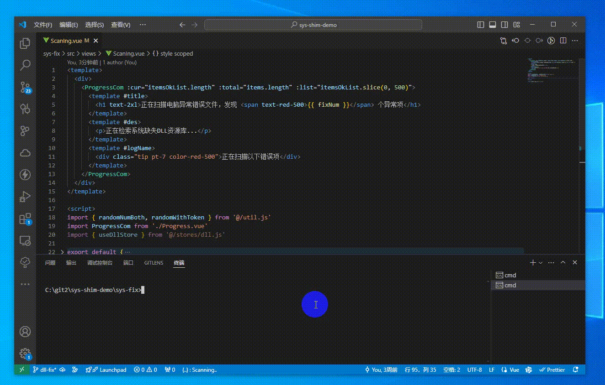

# dll 修复工具

基于 vite/vue3 的简单 dll 修复工具。

<div align="center">
  
</div>

## 开发

``` sh
# 安装依赖
pnpm i

# 运行
pnpm dev

# 打包
pnpm build
```

## 参考
- Visual C++微软常用运行库合集 https://www.gopojie.com/18494.html
- DirectX修复工具使用技巧之三——命令行与配置文件参数介绍 https://cloud.tencent.com/developer/article/2089243
- 共享打印机★检测★修复 ★工具包【升级优化版】v24.04 https://www.bilibili.com/video/BV1vM411X7be/?vd_source=cd2dce3f7db718569d36d6e85f04eca4
- https://iknowledge.lenovo.com.cn/detail/182743
- https://support.hp.com/hk-zh/document/c04739350
- https://iknow.lenovo.com.cn/robot/knowledge/id/417134
- https://www.jb51.net/softs/908986.html
- https://xiazai.zol.com.cn/baike/536934.shtml
